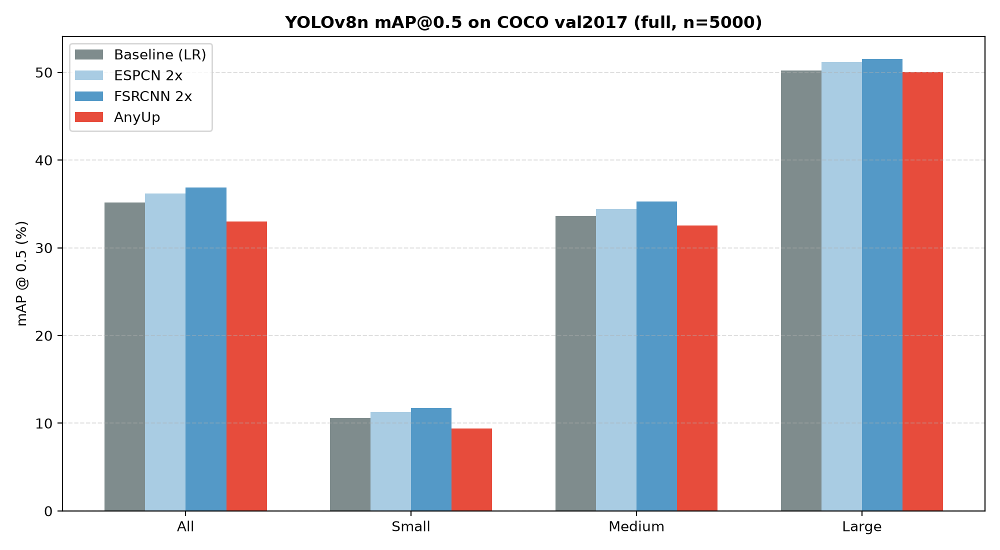
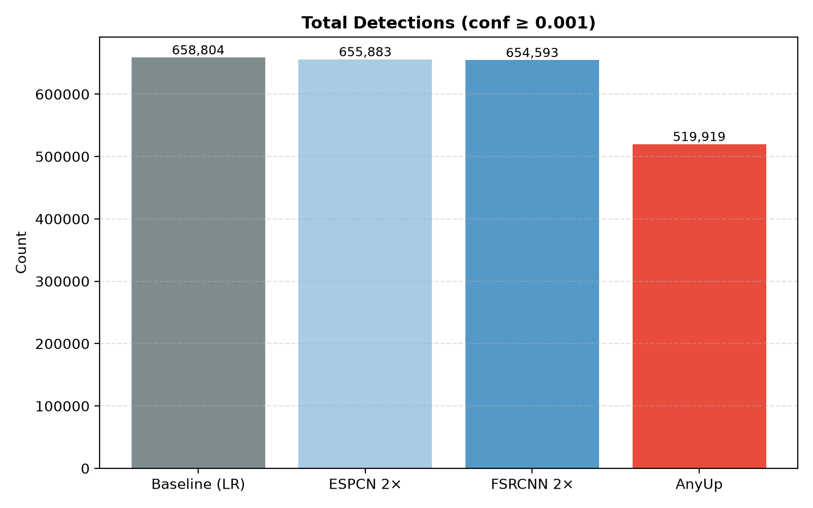
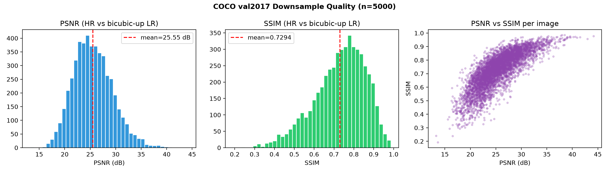
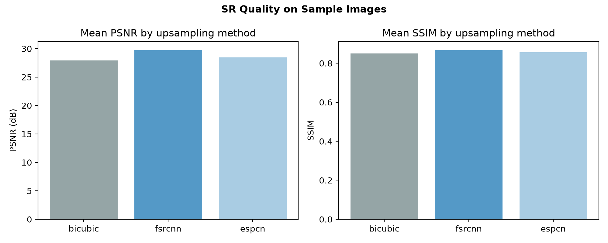
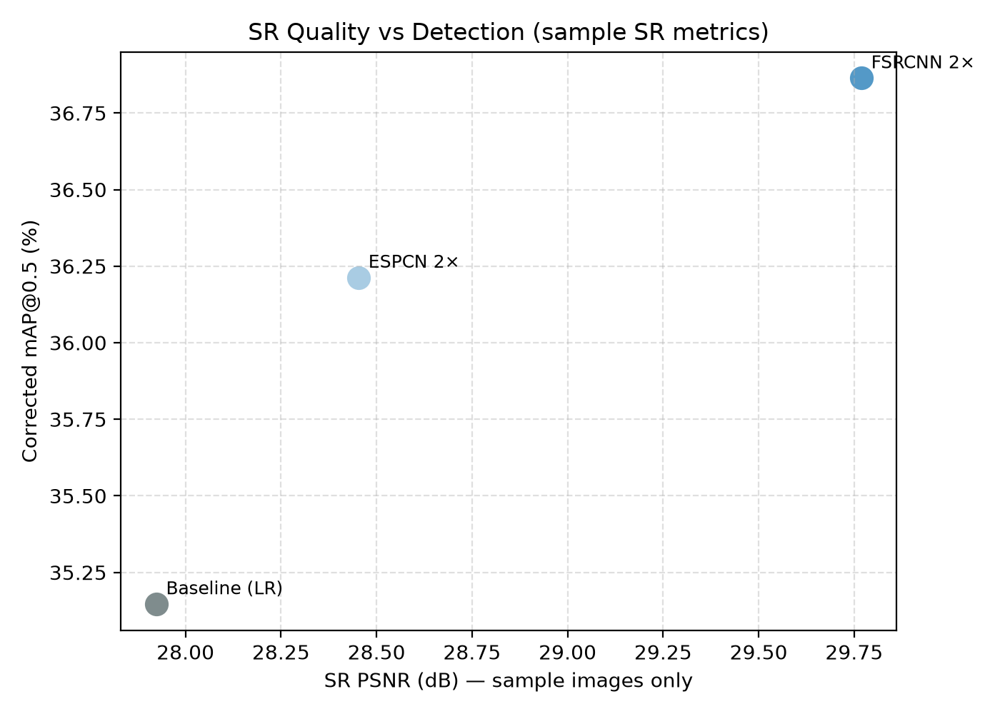

# YOLOv8n × Super-Resolution — COCO Eval Analysis

**Detector:** YOLOv8n (`yolov8n.pt`)  
**Dataset:** COCO val2017 — **full set, 5000 images**  
**LR input:** blur + bicubic 2× downsample (`data/preprocessed/val2017_lr_x2`)  
**Strategies:** baseline (raw LR), ESPCN 2×, FSRCNN 2×, AnyUp  
**Date:** 2026-07-15  
**Canonical numbers:** [`analysis_summary.json`](analysis_summary.json) · LaTeX: [`yolo_eval_analysis.tex`](yolo_eval_analysis.tex)

---

## Report-ready results (full COCO val2017)

**Scope:** all strategies on **all 5000** downsampled val2017 images.

### Official table (percent)

| Strategy | Images | Detections | mAP@0.5 All | Small | Medium | Large | Δ All vs baseline |
|----------|--------|------------|-------------|-------|--------|-------|-------------------|
| Baseline (LR) | 5000 | 658,804 | 35.15% | 10.57% | 33.65% | 50.21% | — |
| ESPCN 2× | 5000 | 655,883 | 36.21% | 11.27% | 34.41% | 51.15% | +1.06 pp |
| **FSRCNN 2×** | **5000** | **654,593** | **36.86%** | **11.73%** | **35.30%** | **51.52%** | **+1.72 pp** |
| AnyUp | 5000 | 519,919 | 33.01% | 9.38% | 32.56% | 50.04% | −2.14 pp |

### Exact floats (`metrics_full_val2017`)

| Strategy | mAP_50_all | mAP_50_small | mAP_50_medium | mAP_50_large |
|----------|------------|--------------|---------------|--------------|
| baseline | 0.351462 | 0.105669 | 0.336474 | 0.502096 |
| espcn2x | 0.362126 | 0.112684 | 0.344090 | 0.511511 |
| fsrcnn2x | 0.368638 | 0.117259 | 0.352955 | 0.515243 |
| anyup | 0.330139 | 0.093836 | 0.325611 | 0.500351 |

### Full-val downsample quality (same 5000 images)

| Mean PSNR | Mean SSIM |
|-----------|-----------|
| 25.55 dB | 0.7294 |

---

## Setup

| Item | Value |
|------|--------|
| Annotations | `data/coco/annotations/instances_val2017.json` |
| Images evaluated | **5000 / 5000** (full val2017) |
| Degrade | Gaussian blur (k=5, σ=2) → bicubic ÷2 |
| Conf threshold | 0.001 |
| Device | CPU |
| Metric | mAP@0.5 (COCO bbox), by object size |

Pipeline: offline downsample → SR / baseline prep → YOLO → COCO mAP vs HR GT.

---

## Detection results

**Takeaway:** Pixel SR (ESPCN / FSRCNN) helps YOLO on degraded COCO; FSRCNN is best. AnyUp is below baseline.

---

## Image degradation quality

---

## SR image quality (sample set)

| Method | Mean PSNR | Mean SSIM |
|--------|-----------|-----------|
| Bicubic | 27.92 dB | 0.850 |
| ESPCN | 28.45 dB | 0.857 |
| FSRCNN | **29.77 dB** | **0.868** |

---

## SR quality vs detection

Note: sample PSNR and full-val detection use different image sets; the trend is qualitative.

---

## Strategy interpretation

- **Baseline:** Detect on degraded LR only.  
- **ESPCN 2×:** +1.06 pp mAP@0.5.  
- **FSRCNN 2×:** Best overall (+1.72 pp all, +1.16 pp small).  
- **AnyUp:** Below baseline (−2.14 pp); fewer detections (~21%). Needs tuning.

---

## Conclusions

1. On full COCO val2017, FSRCNN is the strongest SR front-end for YOLOv8n.  
2. ESPCN also improves over baseline; AnyUp does not in the current setup.  
3. Optional next: HR upper bound; YOLO fine-tune on FSRCNN; Faster R-CNN / DETR.

---

## File index

| Artifact | Path |
|----------|------|
| LaTeX report | `yolo_eval_analysis.tex` |
| Numbers | `analysis_summary.json` |
| Charts | `detection_map_corrected.png`, `detection_counts.png`, `downsample_quality.png`, `sr_*.png` |
| Analysis script | `scripts/analyze_results.py` |
